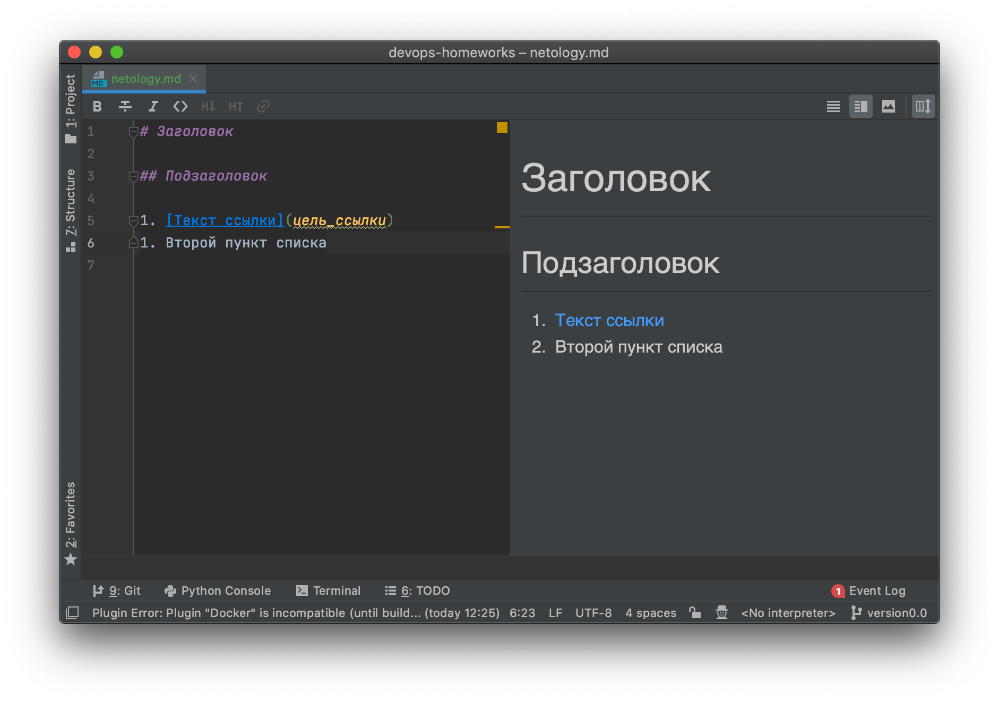

# Домашнее задание к занятию "Введение в DevOps"

### Цель задания

1. Научитесь настраивать окружение для работы
2. Опишите процесс решения задачи в соответствии с жизненным циклом разработки ПО

### Инструкция к заданию

Домашнее задание выполните в файле readme.md в своём репозитории в github или в Google Doc.

1. Сделайте копию [Шаблона для домашнего задания](https://docs.google.com/document/d/1youKpKm_JrC0UzDyUslIZW2E2bIv5OVlm_TQDvH5Pvs/edit) себе на Google Disk.
2. В названии файла введите корректное название лекции и вашу фамилию и имя.
3. Зайдите в “Настройки доступа” и выберите доступ “Просматривать могут все в Интернете, у кого есть ссылка”.
 Ссылка на инструкцию [Как предоставить доступ к файлам и папкам на Google Диске](https://support.google.com/docs/answer/2494822?hl=ru&co=GENIE.Platform%3DDesktop)
4. Выполните домашнее задание, запишите ответы и приложите необходимые скриншоты в свой Google Doc.
5. Для проверки домашнего задания преподавателем отправьте ссылку на ваш документ в личном кабинете.
6. Любые вопросы по решению задач задавайте в чате учебной группы.

### Инструменты и дополнительные материалы, которые пригодятся для выполнения задания

1.  [Py Charm Community Edition](https://www.jetbrains.com/ru-ru/pycharm/download/)
2.  [Visual Studio Code](https://code.visualstudio.com/Download)   
 
 
----     
     
     

## Задание 1. Подготовка рабочей среды

Вы пришли на новое место работы или приобрели новый компьютер.
Первым делом надо настроить окружение для дальнейшей работы. 

1. Установить [Py Charm Community Edition](https://www.jetbrains.com/ru-ru/pycharm/download/) - это бесплатная версия IDE.   
В качестве альтернативы можно установить [Visual Studio Code](https://code.visualstudio.com/Download) и дальнейшие шаги проделать с ним. Таким образом вы сможете выбрать для себя более удобный инструмент.

   Далее для примера будут приведены скриншоты из PyCharm.

2. Установить плагины:
    - Terraform,
    - MarkDown,
    - Yaml/Ansible Support,
    - Jsonnet.
3. Склонировать текущий репозиторий (команда `git clone`) или просто создать файлы для проверки плагинов:
    - [netology.tf](netology.tf) – terraform,
    - [netology.sh](netology.sh) – bash,
    - [netology.md](netology.md) – markdown, 
    - [netology.yaml](netology.yaml) – yaml,
    - [netology.jsonnet](netology.jsonnet) – jsonnet.
4. Убедитесь, что работает подсветка синтаксиса, файлы должны выглядеть вот так:
    - Terraform: 
    - Bash: 
    - Markdown: 
    - Yaml: 
    - Jsonnet: 

*В качестве выполненного задания приведите скриншоты установленной IDE с плагинами в файле readme.md собственного репозитория в GitHub или в Google Doc*

***
> ### Mikhail K
> - Installed Plugins: 
***

## Задание 2. Описание жизненного цикла задачи (разработки нового функционала)

Чтобы лучше понимать предназначение дальнейших инструментов, с которыми нам предстоит работать, давайте 
составим схему жизненного цикла задачи в идеальном для вас случае.

### Описание истории

Представьте, что вы работаете в стартапе, который запустил интернет-магазин. Ваш интернет-магазин достаточно успешно развивался, и вот пришло время налаживать процессы: у вас стало больше конечных клиентов, менеджеров и разработчиков. Сейчас от клиентов вам приходят задачи, связанные с разработкой нового функционала. Задач много, и все они требуют выкладки на тестовые среды, одобрения тестировщика, проверки менеджером перед показом клиенту. В случае необходимости, вам будет необходим откат изменений. 

### Решение задачи

Вам необходимо описать процесс решения задачи в соответствии с жизненным циклом разработки программного обеспечения. Использование какого-либо конкретного метода разработки не обязательно. Для решения главное - прописать по пунктам шаги решения задачи (реализации в конечный результат) с участием менеджера, разработчика (или команды разработчиков), тестировщика (или команды тестировщиков) и себя как DevOps-инженера. 

*Ответ приведите в свободной форме*

***
> ### Mikhail K
> Пошаговое описание процесса решения задачи с участием менеджера, разработчика, тестировщика и DevOps-инженера: <b>
> 1. Получение задачи от клиента: </b>
>     - Клиент отправляет в компанию запрос на разработку нового функционала. <b>
> 2. Анализ и проектирование: </b>
>     - Мы с менеджером и разработчиком обсуждаем требования задачи.
>     - Мы с разработчиком проектируем архитектуру и интерфейсы (сетевые и тд) нового функционала.
>     - МЫ с тестировщиком определяем критерии приемки и необходимые тесты для проверки функционала. <b>
> 3. Разработка: </b>
>     - Разработчик реализует новый функционал, используя спроектированные архитектуру и интерфейсы.
>     - Я готовлю dev и test среды, настраиваю инфраструктуру и автоматические средства развертывания.
>     - Мы с разработчиком осуществляем развертывание на test для дальнейшего тестирования. <b>
> 4. Тестирование: </b>
>     - Тестировщик проводит проверку нового функционала в соответствии с определенными критериями приемки и тестами.
>     - В случае обнаружения ошибок, мы с разработчиком подключаемся для их исправления.
>     - Если тестирование успешно пройдено, задача передается менеджеру для окончательной проверки. <b>
> 5. Одобрение менеджером: </b>
>     - Менеджер оценивает выполнение задачи, проверяет ее соответствие требованиям и принимает решение о дальнейших действиях.
>     - Если задача утверждена, следует показ клиенту. <b>
> 6. Показ клиенту: </b>
>     - Клиент получает доступ к test (или UAT) среде, чтобы оценить и протестировать новый функционал.
>     - После получения обратной связи от клиента, я с разработчиком и тестировщиком рассматриваем возможные изменения и доработки.
>     - Если все Ок, то развертывание на prod: <b>
> 7. Внедрение в prod: </b>
>     - После окончательного одобрения функционала и его успешного тестирования, я разворачиваю фичу на prod.
>     - Я надежно и безопасно настраиваю инфраструктуру, применяю необходимые конфигурации и обеспечиваю плавный ввод фичи в эксплуатацию.
> 
> Такой подход позволяет эффективно сотрудничать всем участникам процесса решения новой задачи, обеспечивая четкое 
> понимание требований, высокое качество функционала и надежное развертывание в производственную среду.
***

### Правила приема домашнего задания

В личном кабинете отправлена ссылка:
- на документ (Google Doc) с выполненным заданием. В документе настроены права доступа “Просматривать могут все в Интернете, у кого есть ссылка”.
- или файл .md в вашем репозитории в github 

### Критерии оценки

Зачет - выполнены все задания, ответы даны в развернутой форме, приложены соответствующие скриншоты и файлы проекта, в выполненных заданиях нет противоречий и нарушения логики.

На доработку - задание выполнено частично или не выполнено, в логике выполнения заданий есть противоречия, существенные недостатки. 
 
