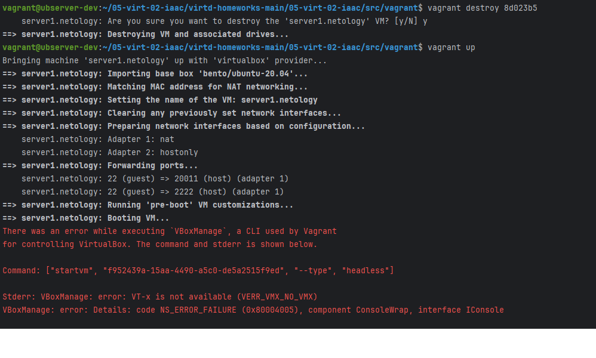

# Домашнее задание к занятию 2. «Применение принципов IaaC в работе с виртуальными машинами»

## Как сдавать задания

Обязательны к выполнению задачи без звёздочки. Их нужно выполнить, чтобы получить зачёт и диплом о профессиональной переподготовке.

Задачи со звёздочкой (*) — дополнительные задачи и/или задачи повышенной сложности. Их выполнять не обязательно, но они помогут вам глубже понять тему.

Домашнее задание выполните в файле readme.md в GitHub-репозитории. В личном кабинете отправьте на проверку ссылку на .md-файл в вашем репозитории.

Любые вопросы по решению задач задавайте в чате учебной группы.

---


## Важно

**Перед началом работы над дипломным заданием изучите [Инструкция по экономии облачных ресурсов](https://github.com/netology-code/devops-materials/blob/master/cloudwork.MD).**

Перед отправкой работы на проверку удаляйте неиспользуемые ресурсы.
Это нужно, чтобы не расходовать средства, полученные в результате использования промокода.

Подробные рекомендации [здесь](https://github.com/netology-code/virt-homeworks/blob/virt-11/r/README.md).

---

## Задача 1

- Опишите основные преимущества применения на практике IaaC-паттернов.
- Какой из принципов IaaC является основополагающим?

***
> ### Mikhail K
> - Идемпотентность; быстрота развертывания; отказоустойчивость; гибкость; масштабируемость; версионирование; автоматизация; облегчение совместной работы, так как все в коде.
> - Идемпотентность, когда применяя одну конфигурацию получаем одинаковый, повторяемый и надежный результат.
***

## Задача 2

- Чем Ansible выгодно отличается от других систем управление конфигурациями?
- Какой, на ваш взгляд, метод работы систем конфигурации более надёжный — push или pull?

***
> ### Mikhail K
> - Не требует установки своего агента внутри ВМ, конфигурации на YAML, поддерживает все основные платформы
> - На мой взгляд, push, так как дает больше контроля при изменениях, а для Ansible, не зависит от состояния агента
***

## Задача 3

Установите на личный linux-компьютер(или учебную ВМ с linux):

- [VirtualBox](https://www.virtualbox.org/),
- [Vagrant](https://github.com/netology-code/devops-materials), рекомендуем версию 2.3.4(в более старших версиях могут возникать проблемы интеграции с ansible)
- [Terraform](https://github.com/netology-code/devops-materials/blob/master/README.md)  версии 1.5.Х (1.6.х может вызывать проблемы с яндекс-облаком),
- Ansible.

*Приложите вывод команд установленных версий каждой из программ, оформленный в Markdown.*
***
> ### Mikhail K
> ```bash
> vagrant@ubserver-dev:~$ vagrant --version
> Vagrant 2.3.4
> ```

> ```bash
> vagrant@ubserver-dev:~$ vboxmanage --version
> 7.0.10_Ubuntur158379
> ```

> ```bash
> curl -LO https://releases.hashicorp.com/terraform/1.5.7/terraform_1.5.7_linux_amd64.zip
> curl -LO https://hashicorp-releases.yandexcloud.net/terraform/1.5.7/terraform_1.5.7_linux_amd64.zip
> 
> vagrant@ubserver-dev:/usr/local/bin$ terraform version
> Terraform v1.5.7
> on linux_amd64
> 
> Your version of Terraform is out of date! The latest version
> is 1.6.6. You can update by downloading from https://www.terraform.io/downloads.html
> ```
> ```bash
> vagrant@ubserver-dev:/usr/local/bin$ ansible --version
> ansible [core 2.14.9]
> ```
> ```bash
> vagrant@ubserver-dev:~$ docker -v
> Docker version 20.10.24, build 297e128
> ```

***


## Задача 4 

Воспроизведите практическую часть лекции самостоятельно.

- Создайте виртуальную машину.
- Зайдите внутрь ВМ, убедитесь, что Docker установлен с помощью команды
```
docker ps,
```

***

> ### Mikhail K
> ```bash
> vagrant@ubserver-dev:~$ docker version
> Got permission denied while trying to connect to the Docker daemon socket at unix:///var/run/docker.sock: Get "http://%2Fvar%2Frun%2Fdocker.sock/v1.24/version": dial unix /var/run/docker.sock: connect: permission denied
> vagrant@ubserver-dev:~$ sudo usermod -aG docker $USER
> usermod: group 'docker' does not exist
>
> vagrant@ubserver-dev:~$ sudo docker version
> Client:
>  Version:           20.10.24
>  API version:       1.41
>  Go version:        go1.20.7
>  Git commit:        297e128
>  Built:             Wed Aug 23 20:54:23 2023
>  OS/Arch:           linux/amd64
>  Context:           default
>  Experimental:      true
> 
> Server:
>  Engine:
>   Version:          20.10.24
>   API version:      1.41 (minimum version 1.12)
>   Go version:       go1.20.7
>   Git commit:       5d6db84
>   Built:            Wed Aug 23 20:55:00 2023
>   OS/Arch:          linux/amd64
>   Experimental:     false
>  containerd:
>   Version:          v1.6.20
>   GitCommit:        2806fc1057397dbaeefbea0e4e17bddfbd388f38
>  runc:
>   Version:          1.1.5
>   GitCommit:
>  docker-init:
>   Version:          0.19.0
>   GitCommit:        de40ad0
> 
> vagrant@ubserver-dev:~$ sudo groupadd docker
> vagrant@ubserver-dev:~$ sudo usermod -aG docker $USER
> 
> vagrant@ubserver-dev:~$ groups vagrant
> vagrant : vagrant adm cdrom sudo dip plugdev lxd docker
> vagrant@ubserver-dev:~$ newgrp docker
> vagrant@ubserver-dev:~$ ls -l /var/run/docker.sock
> srw-rw---- 1 root root 0 Dec 22 20:38 /var/run/docker.sock
> vagrant@ubserver-dev:~$ sudo chmod o+rw /var/run/docker.sock
> vagrant@ubserver-dev:~$ ls -l /var/run/docker.sock
> srw-rw-rw- 1 root root 0 Dec 22 20:38 /var/run/docker.sock
> vagrant@ubserver-dev:~$ docker ps
> CONTAINER ID   IMAGE     COMMAND   CREATED   STATUS    PORTS     NAMES
> ```

***


Vagrantfile из лекции и код ansible находятся в [папке](https://github.com/netology-code/virt-homeworks/tree/virt-11/05-virt-02-iaac/src).

Примечание. Если Vagrant выдаёт ошибку:
```
URL: ["https://vagrantcloud.com/bento/ubuntu-20.04"]     
Error: The requested URL returned error: 404:
```

выполните следующие действия:

1. Скачайте с [сайта](https://app.vagrantup.com/bento/boxes/ubuntu-20.04) файл-образ "bento/ubuntu-20.04".
2. Добавьте его в список образов Vagrant: "vagrant box add bento/ubuntu-20.04 <путь к файлу>".

Важно!: Если ваша хостовая рабочая станция - это windows ОС, то у вас могут возникнуть проблемы со вложенной виртуализацией.  [способы решения](https://www.comss.ru/page.php?id=7726)  . Если вы устанавливали hyper-v или docker desktop то  все равно может возникать ошибка: Stderr: VBoxManage: error: AMD-V VT-X is not available (VERR_SVM_NO_SVM) . Попробуйте в этом случае выполнить в windows от администратора команду: "bcdedit /set hypervisorlaunchtype off" и перезагрузиться

***Приложите скриншоты в качестве решения на эту задачу. Допускается неполное выполнение данного задания если не сможете совладать с Windows.*** 

> ### Mikhail K
> ```bash
> vagrant@ubserver-dev:~$ vagrant box add bento/ubuntu-20.04 ~/05-virt-02-iaac/virtd-homeworks-main/05-virt-02-iaac/src/vagrant/vagrant.box
>  ==> box: Box file was not detected as metadata. Adding it directly...
>  ==> box: Adding box 'bento/ubuntu-20.04' (v0) for provider: 
>      box: Unpacking necessary files from: file:///home/vagrant/05-virt-02-iaac/virtd-homeworks-main/05-virt-02-iaac/src/vagrant/vagrant.box
>  ==> box: Successfully added box 'bento/ubuntu-20.04' (v0) for 'virtualbox'!
> ```
> 

***
